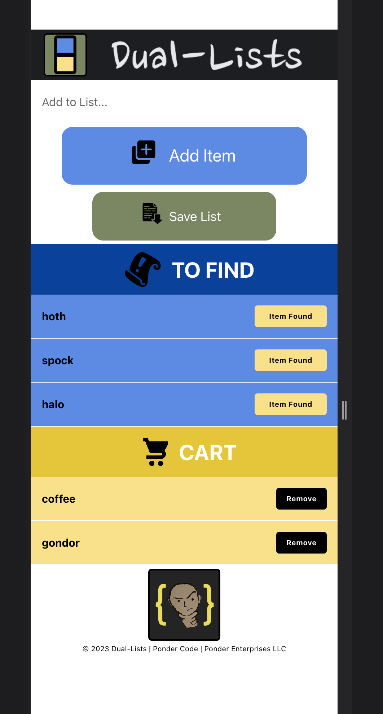
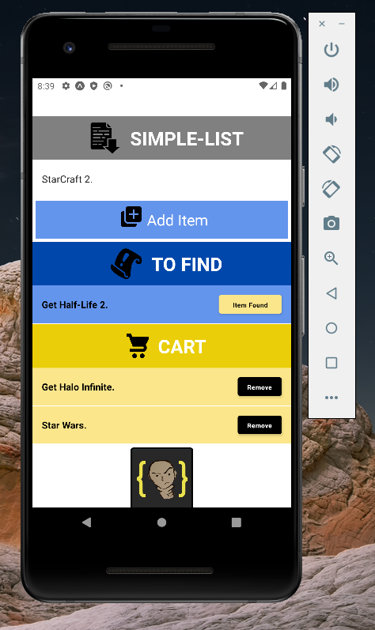

# Shop List Tracker App

## Description:
(React Native (.expo)) | Simple shopping list tracking app. Features include adding new items to the "To Find" list and found items to the "Cart" list.

## Screenshots:

<!--  -->
## Technologies Used:
#### Main:
- React Native
- JavaScript
- .expo
#### Version Control:
- Git
- GitHub
#### Editor:
- VS Code Editor

# References:
#### Development Environment:
// https://www.youtube.com/watch?v=tbLAHKhjjI4
// https://reactnative.dev/docs/environment-setup
// https://docs.expo.dev/workflow/expo-cli/
#### Deployment References:
// https://docs.expo.dev/distribution/uploading-apps/
// https://developer.apple.com/testflight/
// https://pagepro.co/blog/publishing-expo-react-native-app-to-ios-and-android/
// https://www.youtube.com/watch?v=oBWBDaqNuws
// https://stackoverflow.com/questions/64541850/expo-delete-permission-location
#### Information References:
// https://www.youtube.com/watch?v=Hf4MJH0jDb4
// https://developer.mozilla.org/en-US/docs/Web/JavaScript/Reference/Global_Objects/Math/random
// https://www.youtube.com/watch?v=qSRrxpdMpVc
// https://stackoverflow.com/questions/52250061/react-native-how-to-call-multiple-functions-when-onpress-is-clicked/52250225
// https://reactjs.org/docs/hooks-state.html
// https://stackoverflow.com/questions/45685176/center-image-react-native-loading-screen
// https://reactnative.dev/docs/alert
// https://www.youtube.com/watch?v=ByqYR1IwYKY
// https://reactjs.org/docs/hooks-state.html
// https://stackoverflow.com/questions/51375991/clear-textinput-onpress
// https://react-native-async-storage.github.io/async-storage/docs/usage
// https://stackoverflow.com/questions/44376002/what-are-my-options-for-storing-data-when-using-react-native-ios-and-android
// https://stackoverflow.com/questions/44335385/button-refuses-to-centre-horizontally-in-container
// https://app.termly.io/dashboard/website/5fe0f1a2-cce4-42ac-9c42-e67f26c1bb4e/privacy-policy
// https://www.youtube.com/watch?v=PRGHWgTydyQ
#### Images References / Credits:
// HideMaru: https://thenounproject.com/icon/add-3367120/
// Gregor Cresnar: https://thenounproject.com/icon/cart-1015699/
// iconixar: https://thenounproject.com/icon/get-3482205/
// Maxicons: https://thenounproject.com/icon/game-ui-quest-scroll-2360106/
#### Sounds References / Credits:
#### Fonts / Credits:
// https://fonts.google.com/specimen/Roboto
// https://fonts.google.com/specimen/Righteous?preview.text=DUAL-LISTS&preview.text_type=custom#standard-styles